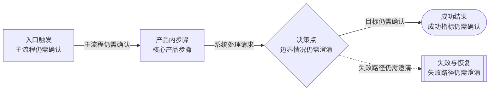

# 流程

## 主流程

- 待补充

## Mermaid 流程图

```mermaid
flowchart LR
  entry["入口触发<br/>主流程仍需确认"]
  experience["产品内步骤<br/>核心产品步骤"]
  decision{"决策点<br/>边界情况仍需澄清"}
  success(["成功结果<br/>成功指标仍需确认"])
  failure[["失败与恢复<br/>失败路径仍需澄清"]]
  entry -->|"主流程仍需确认"| experience
  experience -->|"系统处理请求"| decision
  decision -->|"目标仍需确认"| success
  decision -.->|"失败路径仍需澄清"| failure
```

## 边界情况

- 待补充

## 失败模式

- 待补充
