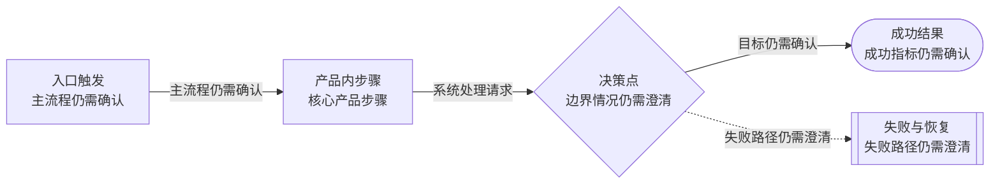
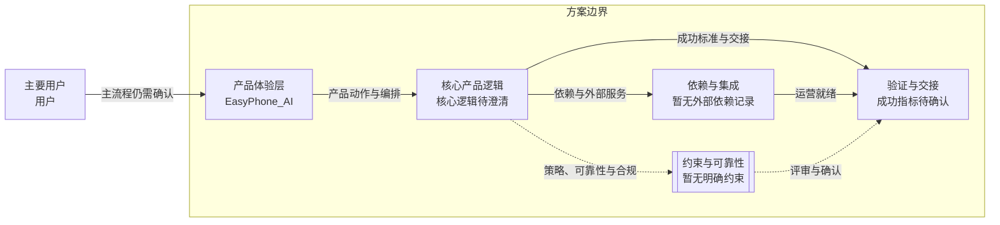

# EasyPhone_AI
> 语言规则：除 PRD、OpenPrd、OpenSpec、API、SDK、CLI、TypeScript、JSON、HTTP、WebSocket、字段 key、命令名、产品名和协议名等必要专有名词外，用户可见内容应使用简体中文。
- 版本: v0001
- 负责人: 待补充
- 产品类型: 未分类
- 模板包: base
- 状态: synthesized
- 生成时间: 2026-06-05 01:39:24
## 元信息

- 标题: EasyPhone_AI
- 负责人: 待补充
- 状态: initialized
- 版本: v0001
- 产品类型: 未分类
- 日期: 2026-06-05

## 问题

- 问题陈述: 待补充
- 为什么是现在: 待补充
- 证据:
  - 待补充

## 用户与相关方

- 主要用户:
  - 待补充
- 次要用户:
  - 待补充
- 相关方:
  - 待补充

## 目标与成功标准

- 目标:
  - 待补充
- 成功指标:
  - 待补充
- 验收目标:
  - 待补充

## 范围与非目标

- 范围内:
  - 待补充
- 范围外:
  - 待补充

## 场景与流程

- 主流程:
  - 待补充
- 边界情况:
  - 待补充
- 失败模式:
  - 待补充

## 可视化图表

### 产品流程

### 架构

## 需求

- 功能需求:
  - 待补充
- 非功能需求:
  - 待补充
- 业务规则:
  - 待补充

## 业务护栏

- 成本来源:
  - 待补充
- 额度与限制:
  - 待补充
- 滥用防护:
  - 待补充
- 监控信号:
  - 待补充
- 报警阈值:
  - 待补充
- 止损动作:
  - 待补充

## 约束、依赖与风险

- 技术约束:
  - 待补充
- 合规要求:
  - 待补充
- 依赖:
  - 待补充
- 假设:
  - 待补充
- 风险:
  - 待补充
- 开放问题:
  - 待补充

## 类型专项模块

- 类型: 类型专项
- note: 请选择产品类型，以启用对应的专项 PRD 模块。

## 交接

- 负责人: 待补充
- 下一步: 评审已生成的 PRD，并准备交接。
- 目标系统: OpenSpec
