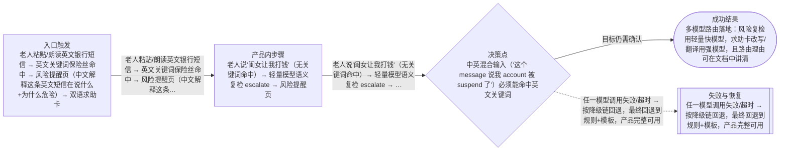
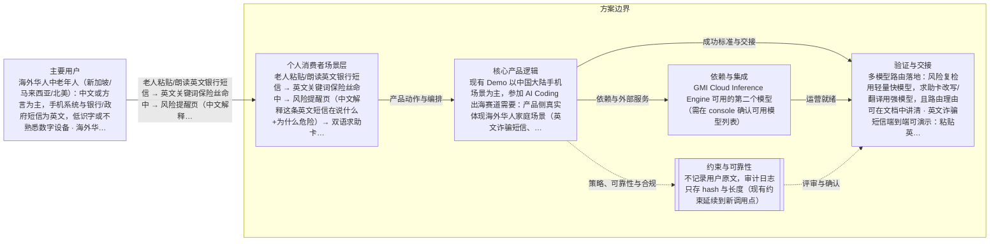

# EasyPhone AI 海外市场改造 + GMI 赛道参赛材料
> 语言规则：默认用简体中文生成 PRD、spec、tasks 和用户可见说明；除 PRD、OpenPrd、OpenSpec、API、SDK、CLI、TypeScript、JSON、HTTP、WebSocket、字段 key、命令名、品牌名、产品名和协议名等必要专有名词外，其余内容优先写成简体中文。
- 版本: v0002
- 负责人: qrx-joe
- 产品场景: 面向个人消费者场景
- 场景模板: 面向个人消费者场景
- 状态: synthesized
- 生成时间: 2026-07-06 23:09:01
## 元信息

- 标题: EasyPhone AI 海外市场改造 + GMI 赛道参赛材料
- 负责人: qrx-joe
- 状态: clarifying
- 版本: v0002
- 产品场景: 面向个人消费者场景
- 日期: 2026-07-06

## 问题

- 问题陈述: 现有 Demo 以中国大陆手机场景为主，参加 AI Coding 出海赛道需要：产品侧真实体现海外华人家庭场景（英文诈骗短信、WhatsApp、双语求助卡），技术侧体现多模型路由与工具链编排，并产出完整参赛提交材料（介绍文档、6+ 页面截图、2+ API 调用证明、Demo 视频脚本）。
- 为什么是现在: 赛事提交截止在即（2026-07），评分维度已公布：技术实现与API调用质量30分、海外场景价值25分、产品完成度25分、创新性15分。当前产品单模型单场景，'多模型能力融合深度、模型路由'与'海外市场洞察'两项会明显失分。
- 证据:
  - 赛事评分表：技术实现与API调用质量 30 分，明确要求多模型能力融合深度、模型路由与工具链编排合理性
  - 海外场景价值 25 分：要求海外用户痛点精准、真实出海落地价值、场景可落地不泛化
  - 现有 README 已定位新加坡/马来西亚/北美华人家庭，但代码仅单模型（DeepSeek-V4-Flash）单一路由

## 用户与相关方

- 主要用户:
  - 海外华人中老年人（新加坡/马来西亚/北美）：中文或方言为主，手机系统与银行/政府短信为英文，低识字或不熟悉数字设备
  - 海外华人家庭子女：异地或跨时区，需要远程理解并处理父母的手机问题与诈骗风险
- 次要用户:
  - 待补充
- 相关方:
  - 赛事评委：按 4 个维度打分，需要完整提交材料与 GMI Cloud API 调用证明
  - GMI Cloud：推理引擎提供方，要求作品体现 Inference Engine 的调用

## 目标与成功标准

- 目标:
  - 待补充
- 成功指标:
  - 多模型路由落地：风险复检用轻量快模型，求助卡改写/翻译用强模型，且路由理由可在文档中讲清
  - 英文诈骗短信端到端可演示：粘贴英文银行/OTP短信 → 中文解释+风险判断 → 双语求助卡
  - 参赛文档 9 个问题全部有实证回答，页面截图≥6张、API调用证明≥2张可直接产出
- 验收目标:
  - pnpm test 全绿，三个安全不变量测试（routing/classify-risk/help-templates）不被破坏
  - 无 API key 时产品仍完整可用（fail-open 不变量保持）
  - 英文关键词扩库遵守 docs/07 §11 三道闸流程

## 验证与创业闭环

- 可触达社区:
  - 待补充
- 第一批种子用户:
  - 待补充
- 当前替代方案: 待补充
- 手工交付路径:
  - 待补充
- 承诺信号:
  - 待补充
- 首个低成本验证: synthesize → review → change → tasks → 实现，完成后产出参赛文档
- 先活下来方案:
  - 待补充

## 范围与非目标

- 范围内:
  - 多模型路由层：按任务类型（风险复检/求助卡改写/双语翻译）路由到不同 GMI 模型，含降级链
  - 英文诈骗短信场景：英文风险关键词扩库（OTP/account suspended/screen share 等）+ 中文解释输出
  - 双语求助卡：求助卡输出中文+英文双版本，便于子女转发当地银行/警方
  - 海外低风险教程 1-2 个（如 WhatsApp 静音）+ demo 友好的 API 调用审计日志展示
  - 参赛文档全套：按飞书模板 9 问撰写，含技术架构图、模型调用链路说明、截图清单、Demo 视频脚本
- 范围外:
  - 真实短信/通讯录读取、远程控制、支付真实操作（项目边界不变）
  - 英文 UI 全站国际化（本轮只做求助卡双语与英文输入理解，不做界面 i18n）
  - 家人端独立 App、社区后台
  - 接入 GMI 以外的第二家推理服务商

## 场景与流程

- 主流程:
  - 老人粘贴/朗读英文银行短信 → 英文关键词保险丝命中 → 风险提醒页（中文解释这条英文短信在说什么+为什么危险）→ 双语求助卡
  - 老人说'闺女让我打钱'（无关键词命中）→ 轻量模型语义复检 escalate → 风险提醒页
  - 老人问 WhatsApp 没声音 → 低风险 → 确认页 → 分步教程
  - 求助卡生成 → 强模型改写中文版 + 翻译英文版 → 子女一键复制转发
- 边界情况:
  - 中英混合输入（'这个 message 说我 account 被 suspend 了'）必须能命中英文关键词
  - 英文关键词大小写、词形变化（suspended/suspend）
  - 翻译模型失败时求助卡退回纯中文模板，不阻塞主流程
- 失败模式:
  - 任一模型调用失败/超时 → 按降级链回退，最终回退到规则+模板，产品完整可用
  - AI 永远不能把关键词保险丝判定的风险降级（不变量）
  - 双语求助卡英文版不得引入'把验证码告诉我'类教给出去话术（四道闸同样适用）

## 可视化图表

### 产品流程

### 架构

## 需求

- 功能需求:
  - 模型路由表：任务类型 → 模型名/温度/超时/降级目标，集中在单一配置文件
  - 英文风险关键词库：按 docs/07 三道闸新增 OTP、bank account suspended、screen sharing、gift card、IRS/tax 等海外高频诈骗词
  - 风险提醒页新增'这条短信在说什么'中文解释区块（AI 生成，失败隐藏）
  - 求助卡双语输出：中文版必有（模板兜底），英文版 AI 生成（失败隐藏英文区块）
  - 教程库新增 WhatsApp 静音场景（低风险白名单）
  - 审计日志页/接口：展示脱敏后的模型调用记录（模型名、任务类型、延迟、决策），供截图作 API 调用证明
- 非功能需求:
  - 所有模型调用走 GMI Cloud OpenAI 兼容接口，key server-only
  - 路由层零外部 SDK，沿用现有 fetch 封装
  - 现有 in-process 限流与日预算护栏对新调用点同样生效
- 业务规则:
  - 待补充

## 业务护栏

- 成本来源:
  - GMI 推理调用：风险复检（每次低风险输入1次）、求助卡改写（每次高风险1次）、英文翻译（每张求助卡1次）
- 额度与限制:
  - 沿用 AI_RATE_LIMIT_PER_10MIN=100 与 AI_DAILY_BUDGET=5000，翻译调用计入同一预算
- 滥用防护:
  - 超预算 fail-open 回模板；无新增放大面
- 监控信号:
  - 审计日志记录每次调用的模型名/任务/延迟/结果
- 报警阈值:
  - 日预算 80% 时日志告警
- 止损动作:
  - ENABLE_AI_RISK_RECHECK=false 一键关停全部 AI 增强

## 约束、依赖与风险

- 技术约束:
  - Next.js 16 App Router + TypeScript 严格模式，不用 any
  - 安全不变量三文件的测试必须保持通过
  - buildRouteForInput() 仍是唯一分流点，英文场景不得新增旁路
- 合规要求:
  - 不记录用户原文，审计日志只存 hash 与长度（现有约束延续到新调用点）
- 依赖:
  - GMI Cloud Inference Engine 可用的第二个模型（需在 console 确认可用模型列表）
- 假设:
  - GMI Cloud 上除 DeepSeek-V4-Flash 外至少还有一个更强的可用模型（如 DeepSeek-V4 / Qwen / Llama 系列）用于改写与翻译
  - 英文关键词能通过 docs/07 三道闸的真实样本验证（可引用 FTC/Scamwatch 公开诈骗样本）
- 风险:
  - 强模型延迟高于 V4-Flash，求助卡异步升级模式需保持'模板秒开、AI 慢补'
  - 中英混合分词：现有关键词匹配若按包含匹配则风险低，若按词边界需处理大小写与词形
- 开放问题:
  - GMI console 上实际可用的第二模型名（实现前用 /v1/models 或 console 确认）

## 类型专项模块

- 类型: 个人消费者场景专项
- persona: 待补充
- segment: 待补充
- journey: 待补充
- activationMetric: 待补充
- retentionMetric: 待补充

## 交接

- 负责人: qrx-joe
- 下一步: synthesize → review → change → tasks → 实现，完成后产出参赛文档
- 目标系统: D:\code\EasyPhone_AI（Next.js 应用）+ docs/hackathon 参赛材料
