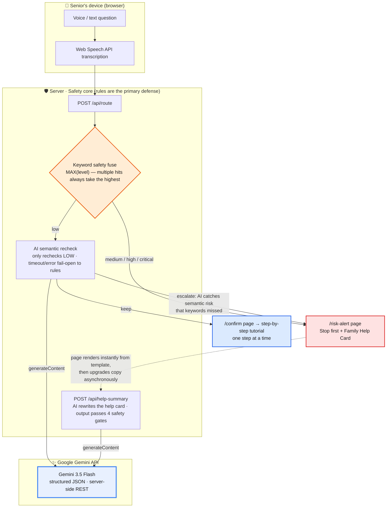

# EasyPhone AI / 爸妈别急 ("Mom & Dad, Don't Panic")

[English](README.en.md) | [中文](README.md)

> An AI phone coach for overseas Chinese seniors: everyday phone problems are taught one step at a time; high-risk situations — OTP / verification codes, bank links, money transfers, unknown WhatsApp contacts, screen sharing — stop the tutorial immediately and generate a Family Help Card instead.

## 1. Project Name & One-liner

**Project name**: EasyPhone AI / 爸妈别急

**One-liner**: EasyPhone AI lets elderly overseas Chinese users speak their phone problem out loud — no typing, no searching. Low-risk problems get step-by-step guidance; high-risk problems immediately halt all instructions and produce a Family Help Card to send to their children.

## 2. Problem Statement

Smartphones have become the gateway to daily life, but for overseas Chinese seniors with limited literacy, limited English, or little digital experience, the phone is often not a convenience — it is a high-pressure system.

The typical difficulties are not "unwillingness to learn":

- They cannot describe the problem precisely — only "WeChat has no sound" or "this text says my health insurance card is blocked";
- They cannot search for tutorials, and cannot follow long text, complex screenshots, or jargon;
- They are afraid of tapping the wrong thing — deleting data, getting charged, leaking a verification code, or losing money;
- When facing OTP / verification codes, "bank account frozen" texts, calls "from the government / immigration office", unknown WhatsApp links, or screen-sharing requests, they cannot tell whether it is a scam;
- When they ask their children for help, they cannot explain what is on the screen, making remote support exhausting.

For the family, the biggest pain is: parents describe problems vaguely, risk is judged too late, and the same problem keeps recurring.

Our primary overseas markets are **Chinese families in Singapore, Malaysia, and North America**. In these families, parents communicate in Chinese or dialect, but the phone OS, banking, government services, delivery notifications, and scam messages frequently arrive in English; the children may live in another city or time zone and cannot provide guidance in real time. EasyPhone AI's value is not generic "teach seniors to use phones" — it is a family-coordinated safety gate placed *before* the risk happens.

## 3. Solution

The core of EasyPhone AI is not "operating the phone for seniors" — it is a phone coach with hard safety boundaries.

Core flow:

```text
Senior asks by voice or text
-> System classifies the question and its risk level
-> Low risk:  confirmation page, then step-by-step tutorial
-> High risk: skip the tutorial, go straight to the risk-alert page
-> Generate a Family Help Card, ready to copy to the children
```

The current demo covers 3 key scenarios:

| Scenario | Risk verdict | Product action |
|---|---|---|
| "WeChat has no sound" | Low risk | Step-by-step tutorial, one step at a time, with voice read-aloud |
| "The font is too small" | Low risk | Large-print, short-sentence guidance through the settings |
| English bank SMS / OTP / WhatsApp screen sharing | High or critical risk | Stop the tutorial immediately; warn: do not transfer money, do not reveal OTP / verification codes, do not tap unknown links, do not start screen sharing; generate a Family Help Card |

The memorable line of this project:

> Most AI assistants try to answer questions. The key to EasyPhone AI is that it knows when it should **stop** answering.

## 4. Technical & Creative Implementation

### Architecture: where the AI steps in



**How to read this diagram**: the keyword safety fuse (orange) is the primary defense — the AI can never downgrade a risk it has flagged. Google Gemini steps in at exactly two points: rechecking semantic risks that slipped past the keywords (escalate-only, never downgrade), and rewriting the senior's vague description into a help card their children can understand at a glance. If any AI call fails, the product falls back to rules and templates — the demo runs end-to-end without an API key.

### Google Gemini API integration

Inference is provided by the **Google Gemini API** through a server-side native `fetch` call with structured output:

| Integration point | Code location | What the AI does | On failure |
|---|---|---|---|
| ① Semantic risk recheck | `src/lib/ai/risk-recheck.ts` | Second-pass semantic sniffing on inputs the keywords judged "low risk" — catches scams like "a relative asking for money" that hit zero risk keywords | fail-open to the keyword verdict |
| ② Family Help Card rewrite | `src/lib/ai/help-summary.ts` | Rewrites the senior's original words into a first-person help note the children instantly understand | fall back to template copy |

```text
endpoint : https://api.gmi-serving.com/v1/chat/completions
model    : gemini-3.5-flash (temperature 0.1, structured JSON output)
config   : .env.local (see .env.example); the key lives server-side only
```

A reproducible audit case (all keywords missed; the Gemini recheck caught it):

```text
Input:   "My daughter messaged me to wire 5,000 to her classmate urgently"
Keyword fuse:    low (0 risk keywords hit)
Gemini recheck:  escalate ← "transfer request received; identity must be verified to prevent fraud"
Final route:     /risk-alert (4.3s)
```

Safety design: AI output must pass strict JSON validation; help-card copy additionally passes three gates — length window → no links → no "hand it over" phrasing (e.g. "send me the verification code") — any failure falls back to the template. All calls carry timeouts, in-process rate limiting, a daily budget, and anonymous audit logs (hash and length only, never the original text).

### Tech stack

| Layer | Technology | Purpose |
|---|---|---|
| Frontend framework | Next.js 16.2.7 + React 19.2.4 | App Router pages and server routes |
| Type system | TypeScript 5 | Strict typing to reduce the chance of accidental changes to risk logic |
| Styling | Tailwind CSS 4 | Senior-friendly large print, strong contrast, mobile layout |
| Voice input | Web Speech API | In-browser speech-to-text, with text input as fallback |
| Voice output | SpeechSynthesis | Every step has a "read it to me" button |
| Risk classification | Local keyword rules + MAX(level) safety fuse | Multiple keyword hits always take the highest risk level |
| Tutorial content | Whitelisted tutorial library | Steps are only emitted for verified low-risk scenarios — no AI-improvised tutorials |
| AI enhancement | Google Gemini API (Gemini 3.5 Flash) | Structured semantic recheck of low-risk inputs + help-card rewriting; rules remain the primary defense |
| Testing | Node.js `node:test` | Covers risk classification, routing, tutorials, help cards |

### Core ideas

- **Classify risk first, then decide whether to answer**: high-risk content never enters the normal tutorial flow — even showing a "confirm" page would implicitly suggest it is safe to proceed.
- **One step at a time**: no long tutorials; minimal reading load for low-literacy seniors.
- **Rules as the floor, not blind faith in models**: once keywords like verification code, transfer, or screen sharing hit, the AI cannot downgrade the risk.
- **Family Help Card**: turns what the senior cannot articulate into an "incident summary + risk level + recommended action" their children can read at a glance.

### Core prompt rules

```text
You are a phone-usage assistant for illiterate / low-literacy elderly users.
You must use short sentences, a slow pace, and minimal jargon.
Give only one step at a time.
Whenever verification codes, transfers, bank cards, unknown links, screen sharing,
remote control, health insurance, social security, loans, or prize-winning appear,
you must immediately stop operational guidance, give only a risk warning, and
suggest contacting family or official channels.
You must never guide the user to transfer money, enter a verification code,
download an unknown app, start screen sharing, or reveal a payment password.
```

## 5. Current Progress

| Module | Status | Notes |
|---|---|---|
| M0 Project setup | Done | Next.js + TypeScript + Tailwind, runnable |
| M1 Core domain model | Done | risk / question / tutorial / help / routing under `src/domain` |
| M2 Home & input flow | Done | Text input, voice input, demo entries |
| M3 Low-risk step-by-step guidance | Done | "WeChat no sound", "font too small", etc. |
| M4 High-risk interrupt + Family Help Card | Done | Verification code, screen sharing, etc. route straight to the alert page |
| M5 AI integration | Done | Google Gemini at two core points: semantic risk recheck + help-card rewrite; structured output + fail-open |
| M6 Demo polish & deployment | Done | Live Vercel demo and a demo video |

> **Recent demo enhancements** (ongoing M6 polish):
> - **Companion mascot**: a voice-persona anchor on low-risk tutorial pages ("I'm listening / I'm teaching"), deliberately omitted from high-risk pages so it doesn't dilute the warning
> - **App tile icons**: desktop-icon-style color blocks before tutorials and quick entries, helping elders recognize "which app" by color
> - **a11y contrast guard**: build-time P0 contrast validation so large accessible type never drops below the WCAG safety line

This project is a demonstrable MVP: the core loop, live demo, and demo video are ready. The next focus is collecting real scam samples from overseas Chinese families, bilingual prompts, and family feedback — expanding the tutorial library from "common phone problems in China" into an "overseas Chinese family digital-safety scenario library".

## 6. Safety Boundaries

EasyPhone AI will never:

- Read SMS, contacts, or location;
- Perform remote control;
- Guide transfers, verification-code entry, or payment passwords;
- Guide installing unknown apps or starting screen sharing;
- Put high-risk content into a public community;
- Hand the safety verdict entirely to an AI.

This is not conservatism — it is the baseline for a seniors' product. In an anti-fraud context, an AI that "helps recklessly" is more dangerous than one that doesn't help at all.

## 7. Impact & Sustainability

EasyPhone AI targets a real, long-lived problem: seniors do not lack smartphones — they lack digital assistance that is *slower, shorter, and safer*.

Potential impact:

- **Family**: lower remote-support cost for children; faster help-seeking when parents face risk.
- **Overseas communities**: usable by Chinese community centers, senior service stations, and volunteers as a digital-safety training tool.
- **Anti-fraud**: moves "don't transfer, don't reveal OTP / verification codes, don't tap bank links, don't start screen sharing" to *before* the action happens.
- **Sustainable iteration**: the whitelisted tutorial library accumulates high-frequency problems; future work includes a family-side view, dialect / Chinese-English mixed ASR, screenshot recognition, and a community review console.

## 8. Links

| Material | Link |
|---|---|
| GitHub repository | <https://github.com/qrx-joe/EasyPhone_AI> |
| Live demo | <https://easy-phone-ai.vercel.app> |
| Demo video (Chinese) | <https://www.bilibili.com/video/BV15mEX6dEBt/> |
| English demo video script | [docs/demo-video-script-en.md](docs/demo-video-script-en.md) |
| Authoritative PRD (Chinese) | [docs/00-prd-cn-authoritative.md](docs/00-prd-cn-authoritative.md) |
| Development plan | [docs/06-development-plan.md](docs/06-development-plan.md) |
| Risk keyword library | [docs/07-risk-keywords-library.md](docs/07-risk-keywords-library.md) |

## 9. Run Locally

```bash
pnpm install
pnpm dev
```

Open <http://localhost:3000>.

Enable AI enhancement (optional — everything works without it): copy `.env.example` to `.env.local` and fill in your Google AI Studio key (`GEMINI_API_KEY`); the endpoint and model name are already in the example file.

You can also open the demo routes directly:

- <http://localhost:3000/tutorial/demo?case=wechat> — "WeChat has no sound" tutorial
- <http://localhost:3000/tutorial/demo?case=font> — "Font too small" tutorial
- <http://localhost:3000/risk-alert/demo?case=medical-sms> — health-insurance SMS / verification-code risk
- <http://localhost:3000/risk-alert/demo?case=screen-share> — screen-sharing risk
- <http://localhost:3000/risk-alert/demo?case=overseas-bank> — English "bank account frozen" SMS risk
- <http://localhost:3000/risk-alert/demo?case=overseas-whatsapp> — WhatsApp screen-sharing risk

> Note: the product UI is intentionally Chinese — the target users are Chinese-speaking seniors. This README exists so that non-Chinese-speaking reviewers can understand the architecture and safety design.
