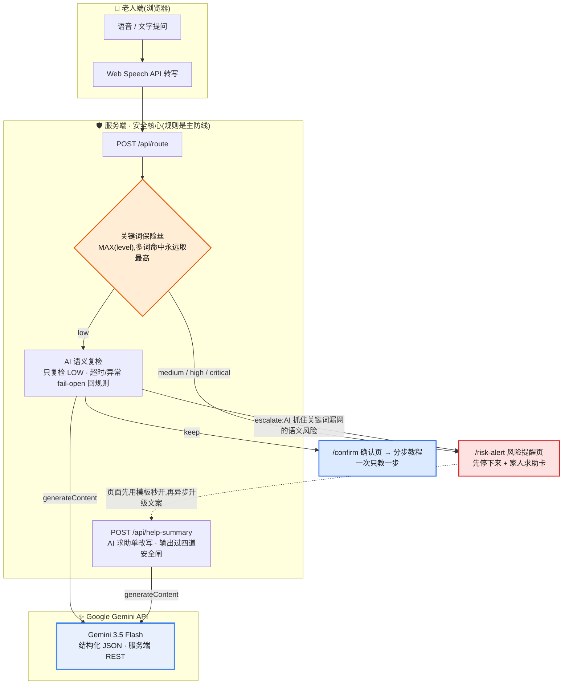

# 爸妈别急 / EasyPhone AI

[中文](README.md) | [English](README.en.md)

> 面向海外华人家庭的 AI 安全手机教练：普通手机问题一步一步教，遇到 OTP / 验证码、银行链接、转账、陌生 WhatsApp、屏幕共享等高风险场景时，先停下来，再生成家人求助卡。

## 1. 项目名称 + 一句话简介

**项目名称**：EasyPhone AI / 爸妈别急

**一句话简介**：EasyPhone AI 让海外华人老人不用打字、不用搜索，直接说出手机问题；低风险问题一步一步带做，高风险问题立即停止指导并生成家人求助卡。


## 2. 问题陈述

智能手机已经变成生活入口，但对低识字、英语能力有限或不熟悉数字设备的海外华人中老年人来说，它经常不是便利工具，而是高压系统。

老人常见的困难不是“不想学”，而是：

- 不会准确表达问题，只会说“微信没声音了”“这个短信说医保卡不能用了”；
- 不会搜索教程，也看不懂长文字、复杂截图和专业术语；
- 害怕点错，担心误删、扣费、泄露验证码或把钱弄没；
- 遇到 OTP / 验证码、银行账户冻结短信、政府/移民局来电、陌生 WhatsApp 链接、屏幕共享等场景时，很难判断是不是诈骗；
- 向子女求助时说不清页面和问题，远程沟通成本很高。

对家人来说，最大痛点是：父母的问题描述不清、风险判断不及时，同一个问题又会反复发生。

本项目的首选海外市场是**新加坡、马来西亚和北美华人家庭**。这些家庭常见特点是：父母日常仍使用中文或方言沟通，但手机系统、银行、政府服务、物流通知和诈骗短信经常混用英文；子女可能在异地或跨时区，无法随时远程指导。EasyPhone AI 的价值不是泛泛地“教老人用手机”，而是在风险发生前建立一道家庭协同安全闸门。

## 3. 解决方案

EasyPhone AI 的核心不是“替老人操作手机”，而是做一个有安全边界的手机教练。

核心流程：

```text
老人语音或文字提问
-> 系统判断问题和风险等级
-> 低风险：进入确认页，再一步一步指导
-> 高风险：跳过教程，进入风险提醒页
-> 生成家人求助卡，方便复制给子女确认
```

当前 Demo 覆盖 3 个关键场景：

| 场景 | 风险判断 | 产品动作 |
|---|---|---|
| 微信没有声音 | 低风险 | 进入分步教程，每次只显示一步，并支持语音播报 |
| 手机字体太小 | 低风险 | 用大字和短句引导老人完成设置 |
| 英文银行短信 / OTP / WhatsApp 屏幕共享 | 高风险或极高风险 | 立即停止教程，提醒不要转账、不要说验证码或 OTP、不要点陌生链接、不要开屏幕共享，并生成家人求助卡 |

项目的记忆点是：

> 大多数 AI 助手都试图回答问题。EasyPhone AI 的关键是：它知道什么时候不该继续回答。

## 4. 技术或创意实现

### 架构:AI 在哪里介入



**读图要点**:关键词保险丝(橙)是安全主防线,AI 永远不能把它判定的风险降级;Google Gemini 在两个核心位置介入 —— 复检规则漏网的语义风险(只升不降),以及把老人的模糊表达改写成家人能看懂的求助单。Gemini 任何一环失败,产品都会回退到规则与模板,Demo 不依赖 API key 也能完整跑通。

### Google Gemini API 接入

本项目的推理能力由 **Google Gemini API** 提供。服务端使用原生 `fetch` 调用 `generateContent`,API key 不下发浏览器；通过结构化输出 schema 约束模型返回:

| 接入点 | 代码位置 | AI 做什么 | 失败时 |
|---|---|---|---|
| ① 风险语义复检 | `src/lib/ai/risk-recheck.ts` | 对关键词判为"低风险"的输入做二次语义嗅探,抓"冒充亲属要钱"这类无风险词命中的诈骗 | fail-open 回关键词结果 |
| ② 家人求助单改写 | `src/lib/ai/help-summary.ts` | 把老人原话改写成子女一眼能懂的第一人称求助说明 | 回退到模板文案 |

```text
endpoint : https://generativelanguage.googleapis.com/v1beta/models/{model}:generateContent
model    : gemini-3.5-flash(温度 0.1,结构化 JSON 输出)
配置     : .env.local(见 .env.example),key 仅存在于服务端
```

一条待真实联调的审计测试向量（关键词全部漏网，预期由 Gemini 复检升级）：

```text
输入:「闺女发消息让我给她同学打五千块应急」
关键词保险丝: low(0 个风险词命中)
预期 Gemini 复检: escalate ← "收到要求转账的请求，需核实身份防诈骗"
预期最终路由:      /risk-alert
```

真实联调前不把预期结果写成实测结果。配置 `GEMINI_API_KEY` 后，可运行
`pnpm smoke:gemini` 生成不含密钥和原始输入的脱敏证据。

安全设计:AI 输出必须通过严格 JSON 校验;求助单文案额外过"长度窗口 → 禁链接 → 禁『教给出去』话术"三道闸,任一不过即回退模板;所有调用带超时、进程内限流、日预算与匿名审计日志(只记 hash 与长度,不记原文)。

### 技术栈

| 层级 | 技术 | 用途 |
|---|---|---|
| 前端框架 | Next.js 16.2.7 + React 19.2.4 | App Router 页面与服务端路由 |
| 类型系统 | TypeScript 5 | 严格类型约束，降低风险逻辑误改概率 |
| 样式 | Tailwind CSS 4 | 适老化大字、强对比、移动端布局 |
| 语音输入 | Web Speech API | 浏览器端语音转文字，失败时保留文字输入兜底 |
| 语音播报 | SpeechSynthesis | 每个步骤可“念给我听” |
| 风险判断 | 本地关键词规则 + MAX(level) 安全保险丝 | 多关键词命中时永远取最高风险等级 |
| 教程内容 | 白名单教程库 | 只对已验证低风险场景输出步骤，避免 AI 乱教 |
| AI 增强 | Google Gemini API(Gemini 3.5 Flash) | 低风险输入的语义复检 + 家人求助单改写;结构化输出;AI 失败时产品完整可用 |
| 测试 | Node.js `node:test` | 覆盖风险分类、路由、教程、求助卡等核心逻辑 |

### 核心创意

- **先分风险，再决定是否回答**：高风险内容不进入普通教程，避免“确认页”本身给老人造成可以继续操作的暗示。
- **一次只教一步**：不输出长篇教程，减少低识字老人阅读压力。
- **规则兜底，不迷信模型**：验证码、转账、屏幕共享等风险词命中后，AI 不能把风险降级。
- **家人求助卡**：把老人说不清的问题整理成子女能看懂的“事件总结 + 风险等级 + 建议动作”。

### 核心 Prompt 规则

```text
你是一个面向不识字 / 低识字中老年人的手机使用助手。
你必须使用短句、慢节奏、低术语表达。
每次只给一步操作。
遇到验证码、转账、银行卡、陌生链接、屏幕共享、远程控制、医保、社保、贷款、中奖等内容时，必须立即停止操作指导，只给出风险提醒，并建议联系家人或官方渠道确认。
你不能指导用户转账、输入验证码、下载陌生 App、打开屏幕共享或提供支付密码。
```

## 5. 当前进展

| 模块 | 状态 | 说明 |
|---|---|---|
| M0 项目初始化 | 已完成 | Next.js + TypeScript + Tailwind 项目可运行 |
| M1 核心领域模型 | 已完成 | 风险、问题、教程、求助卡、路由逻辑拆到 `src/domain` |
| M2 首页与输入流程 | 已完成 | 支持文字输入、语音输入、Demo 入口 |
| M3 低风险分步指导 | 已完成 | 微信没声音、字体太小等场景可逐步指导 |
| M4 高风险中断 + 家人求助卡 | 已完成 | 验证码、屏幕共享等高风险输入直接进入提醒页 |
| M5 AI 接入 | 代码完成，真实联调待认证 | Google Gemini 双接入点：风险语义复检 + 家人求助单改写；结构化输出 + fail-open；无 key 时走规则与模板 |
| M6 Demo 打磨与部署 | 参赛分支已公开，新版部署待完成 | 旧版 Vercel Demo 与 B 站演示视频可访问；评审应以参赛分支为准 |

> **近期 Demo 增强**（M6 持续打磨）：
> - **陪伴小精灵**：低风险教程页的语音人格锚点（"我在听 / 我在教"），高风险页刻意不放——避免稀释警示的恐惧感
> - **App 磁贴图标**：教程与快捷入口前的仿桌面图标色块，帮老人靠颜色认"说的是哪个 App"
> - **a11y 对比度护栏**：构建期 P0 对比度校验，防止适老化大字跌出 WCAG 安全线

本项目当前是可演示 MVP：核心闭环和演示视频已经准备好，Google AI 参赛分支已公开；新版线上部署与真实 Gemini 联调仍须完成。下一步重点是补充海外华人家庭的真实诈骗样本、双语提示词和家属反馈，把教程库从“中国手机常见问题”扩展为“海外华人家庭数字安全场景库”。

## 6. 安全边界

EasyPhone AI 不做这些事：

- 不读取短信、通讯录、定位；
- 不做远程控制；
- 不指导转账、输入验证码、提供支付密码；
- 不指导下载陌生 App 或打开屏幕共享；
- 不把高风险内容放进公开社区；
- 不把安全判断完全交给 AI。

这不是保守，这是老人产品的底线。一个会“乱帮忙”的 AI，在反诈场景里比不会帮忙更危险。

## 7. 影响力或可持续性

EasyPhone AI 面向的是一个真实而长期存在的问题：老人并不缺智能手机，他们缺的是“慢一点、短一点、安全一点”的数字协助。

潜在影响：

- **家庭场景**：减少子女远程指导成本，提升父母遇到风险时的求助效率。
- **海外社区场景**：可作为华人社区中心、长者服务站、志愿者数字安全培训工具。
- **反诈场景**：把“不要转账、不要说 OTP / 验证码、不要点银行链接、不要开屏幕共享”前置到操作发生前。
- **可持续迭代**：通过白名单教程库沉淀高频问题，后续扩展家人端、方言/中英混合 ASR、截图识别和社区审核后台。

## 8. 附加材料链接

| 材料 | 链接 |
|---|---|
| GitHub 仓库 | <https://github.com/qrx-joe/EasyPhone_AI> |
| Google AI 参赛分支 | <https://github.com/qrx-joe/EasyPhone_AI/tree/contest/google-ai-vibeathon-2026> |
| 参赛版 Preview | <https://easy-phone-ai-git-contest-google-ai-vi-c361ce-qrx-joes-projects.vercel.app> |
| 在线 Demo | <https://easy-phone-ai.vercel.app> |
| 演示视频 | <https://www.bilibili.com/video/BV15mEX6dEBt/> |
| 权威 PRD | [docs/00-prd-cn-authoritative.md](docs/00-prd-cn-authoritative.md) |
| 开发计划 | [docs/06-development-plan.md](docs/06-development-plan.md) |
| 风险关键词库 | [docs/07-risk-keywords-library.md](docs/07-risk-keywords-library.md) |

## 9. 本地运行

```bash
pnpm install
pnpm dev
```

打开 <http://localhost:3000>。

启用 AI 增强(可选,不配也能完整跑通):复制 `.env.example` 为 `.env.local`,
填入 Google AI Studio 创建的 key(`GEMINI_API_KEY`)即可,endpoint 与模型名已在样例中给出。

也可以直接访问 Demo 路径：

- <http://localhost:3000/tutorial/demo?case=wechat>：微信没声音教程
- <http://localhost:3000/tutorial/demo?case=font>：字体太小教程
- <http://localhost:3000/risk-alert/demo?case=medical-sms>：医保短信 / 验证码风险
- <http://localhost:3000/risk-alert/demo?case=screen-share>：屏幕共享风险
- <http://localhost:3000/risk-alert/demo?case=overseas-bank>：英文银行账户冻结短信风险
- <http://localhost:3000/risk-alert/demo?case=overseas-whatsapp>：WhatsApp 屏幕共享风险
